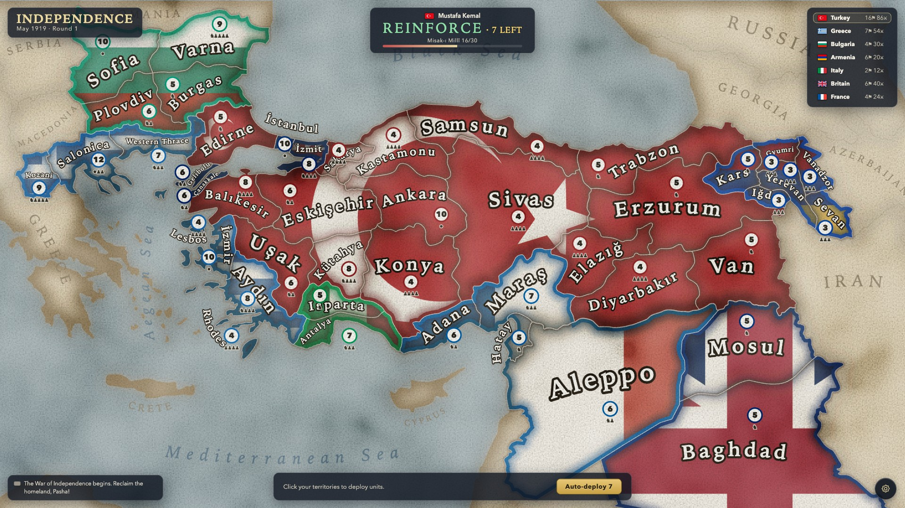
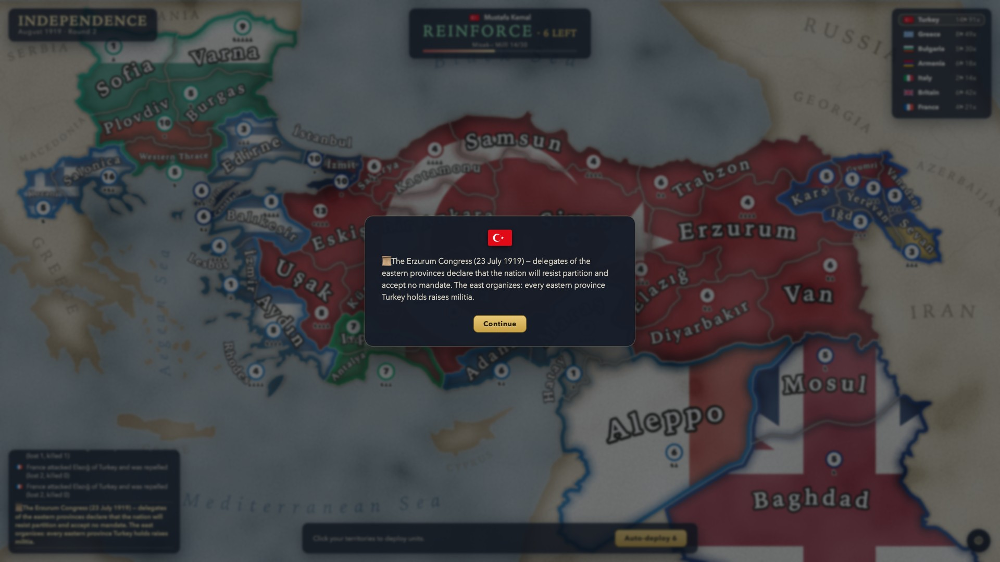
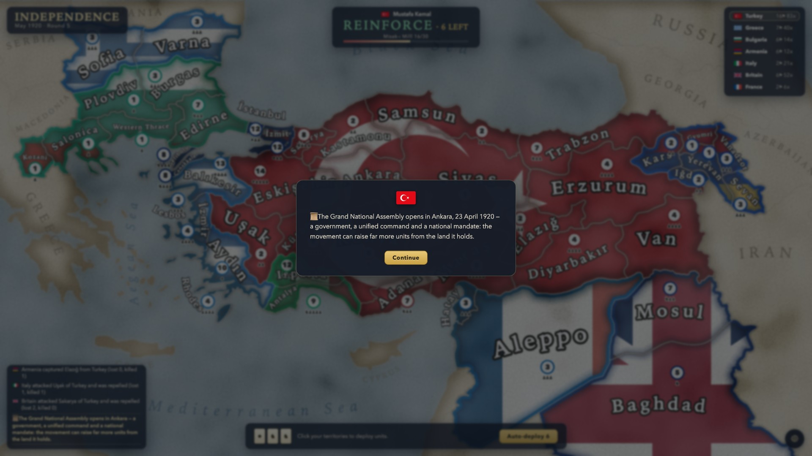
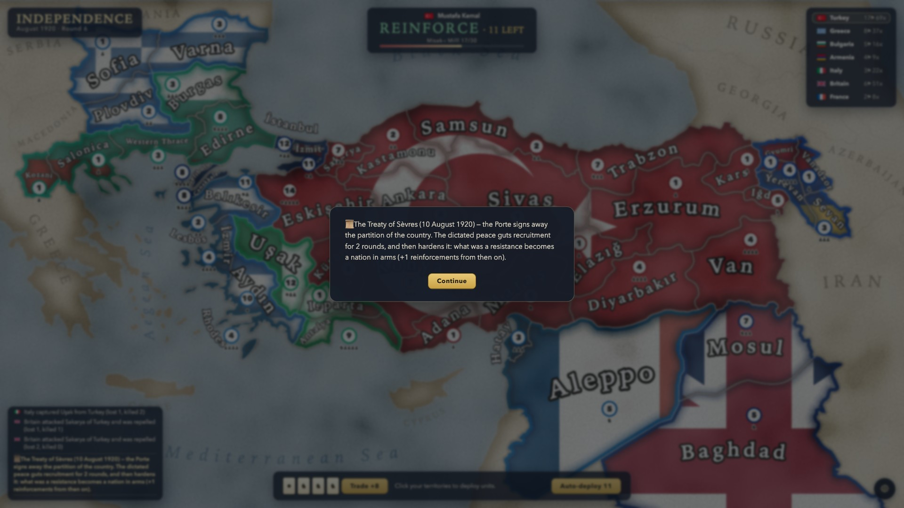
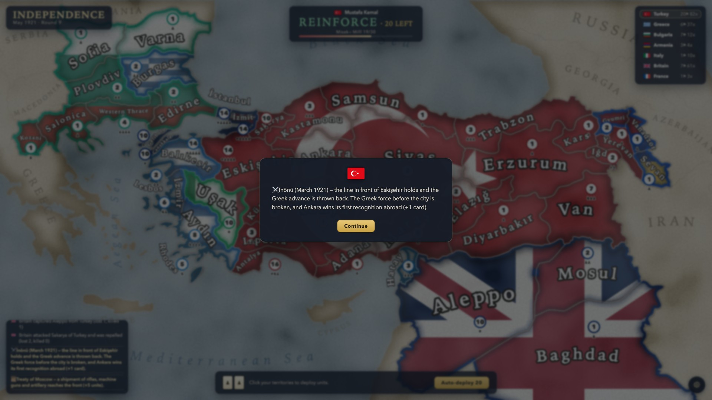
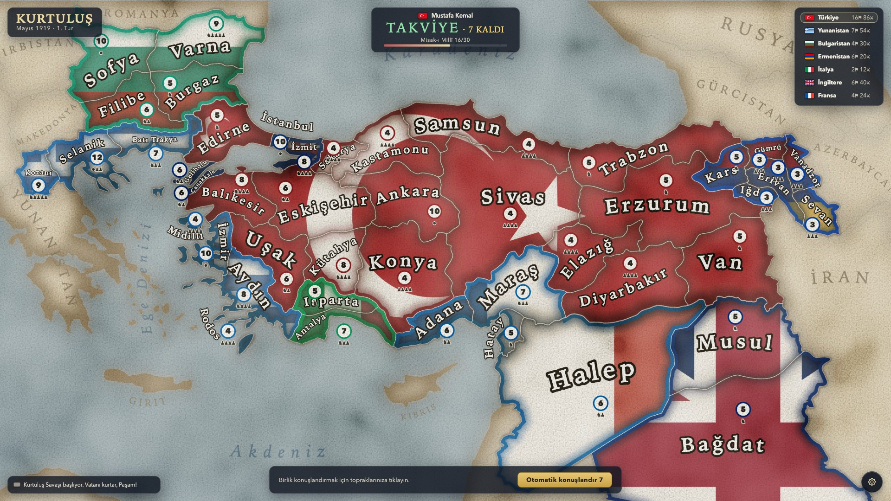

# Independence

A Risk-style strategy game about the Turkish War of Independence, from Mustafa
Kemal's landing at Samsun in May 1919 to the last foreign soldier leaving. Play
it at **[kurtulus1919.com](https://kurtulus1919.com)**, in English or Turkish.



You start where the movement started: sixteen provinces, most of them inland, a
coastline in other people's hands, and six factions on the map — Greece in
İzmir, Britain on the Straits, France in Cilicia, Italy in the southwest,
Armenia in the east, Bulgaria across the Thracian border.

The war aim is not the map. It is the **Misak-ı Millî**, the National Pact:
thirty provinces from Edirne to Kars and down to Mosul, the borders the last
Ottoman parliament voted for in January 1920 and the Ankara government spent
four years making real.

## Playing

```sh
npm install
npm start      # http://localhost:1234
npm test
```

- **Reinforce** — deploy the levy across your provinces.
- **Attack** — pick a province, then an adjacent enemy. Risk dice, with blitz
  resolution and exact odds behind the AI's decisions.
- **Fortify** — move troops along your own lines, then end the turn and watch
  six AI factions play theirs.
- Conquering draws a supply card; escalating sets trade for troops.
- Pinch to zoom, two-finger scroll to pan. The whole thing runs on a phone.

## The history is the mechanics

Nothing here is flavour text bolted onto a Risk clone. The rules are arguments
about what actually happened, and the historical constraints *are* the
constraints you play against.

**You cannot conquer your way out.** Ankara's war aim was a defined border, and
it renounced everything beyond it — so the game does too. Turkey may not attack
outside the National Pact while the Pact is unmet. Sofia is right there,
undefended, and the order is refused. You are not building an empire; you are
recovering a country and stopping. (There are ways to earn an exception. They
have to be earned.)

**Twenty-eight dated events run through the campaign**, from the congresses of
1919 to the treaties of the mid-twenties. Each one arrives on the turn its real
date falls in, and each one changes something material — what you can recruit,
how your army fights, who is still willing to fight you, who quietly goes home.
A few of them stop and ask you a question instead.

Most of them are **conditional**. An event checks whether the situation that
made it possible actually came about in *your* war, and if it didn't, it waits,
or it never happens at all. A congress needs the city it was held in. A
government needs a capital to sit in, and everything that government did
presupposes that it existed. A power does not collapse, sue for peace or lose
an election while it is winning. Play the war differently and history comes out
differently — later, or not at all.

**The army changes character as the movement does.** It begins as scattered
Kuvâ-yi Milliye irregulars who cannot mount a proper offensive, and it does not
stay that way. Invaders pushing into the homeland fight harassed supply lines
rather than a fair battle — until the war moves into the open field.

Smaller things that are also true: Bulgaria is not in the Entente and its army
is capped by the Treaty of Neuilly; Kars and Iğdır begin under Armenian
administration, as they did in 1919; post-war demobilization means London will
not raise fresh divisions for Anatolia; an occupier left unchallenged digs in,
so passivity costs you exactly where it matters; and a power that has made peace
will fight again if you break it.

Turning points arrive as cards.

|  |  |
|---|---|
|  |  |
|  |  |

How it ends depends on what you hold when the time comes — and holding it is not
the same as reaching it. That part you can find out for yourself.

## The AI is trained, not written

Every faction is played by its own neural network, learned from self-play rather
than from rules somebody typed out. Seven networks, one per faction — and they
are seven different players, because each is paid for a different thing.

A hand-written AI would have to be told that Britain garrisons the Straits and
will not spend divisions inland, that Italy fought nobody, that Bulgaria's
quarrel is with Greece and not with Ankara. Here that comes out of the reward
functions: each faction's war aim is a handful of provinces and a stance on
casualties, and what it does with them is its own business. Turkey is scored on
the National Pact, and on nothing outside it.

The network scores (position, move) pairs rather than choosing from a fixed list
of actions — a Risk turn offers hundreds of from→to pairs, and one output per
pair would be mostly dead weights. Stopping is always one of the moves, which is
how a faction learns that doing nothing beats everything else on offer.

```sh
npm run train-ai -- --games 50000     # or --resume to carry on
```

Self-play, epsilon-greedy over the value net, a prioritised replay buffer, and a
reward that is the turn's own shaping plus the end of the war discounted back
over the decisions that led there. Models land in `src/ai/models/` and ship with
the game, so what you play against is exactly what was trained. Every move the
models produce goes through the engine's own legality checks first, so a trained
faction can no more break the rules than a hand-written one.

## Both languages

English and Turkish, switchable mid-game — the cards, the log, the map, all of
it.

| English | Türkçe |
|---|---|
|  |  |

## How the map works

The territories are real geography. `scripts/generate-map-data.mjs` turns
`src/assets/map-whiteborder.svg` — 91 anonymous paths, identified by hand — into
`src/game/map-data.json`: 45 territories with baked bounding boxes, label anchors
and measured geometric adjacency. Kars and Iğdır are regions in their own right,
drawn from real province outlines (`scripts/carve.json`); Erzurum's own outline
is reshaped so its eastern edge *is* their western border, point for point,
rather than leaving holes to line up.

Rendering is a stack of SVG filter layers in `MapView.tsx`: vectorized faction
flags cover-scaled over contiguous blobs, solid national border lines with inner
shadows, per-region multiply shading, coastal glow, and paper grain, wash and
vignette. Region names are laid out by a small type engine (`labelLayout.ts`)
that fits arced text inside arbitrary shapes via PCA and a curved-midline fit.

## Tests

The engine in `src/game/game.ts` has no browser dependencies, so Node imports it
as-is and the tests run against the real thing — no mocks, no test double of the
rules.

```sh
npm test
```

Tests across two dozen files: dice odds by exhaustive enumeration, the event
table and its conditions, combat, economy, saves, Turkish morphology, the
camera, the trained AI's rewards and the shipped models, and long scenario tests
that play whole campaigns turn by turn and assert which event fired on which
round under which circumstances.

## License

[MIT](LICENSE)
